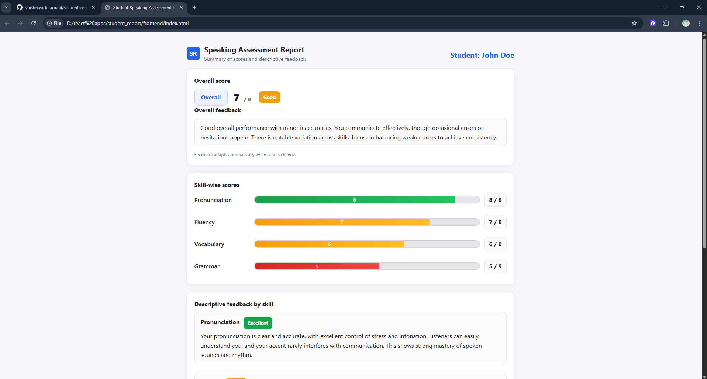
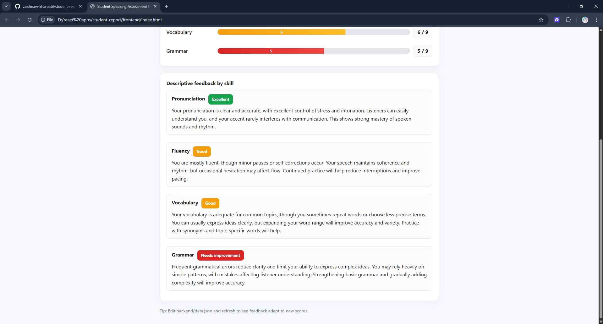

# Student Speaking Assessment Report

## How to Run

1. Clone the repository.
2. Navigate to `backend/` and install dependencies:
   ```bash
   npm init -y
   npm install express cors
   node server.js


   


   